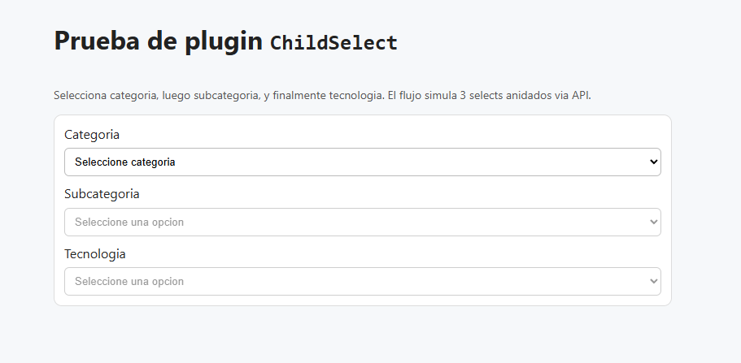
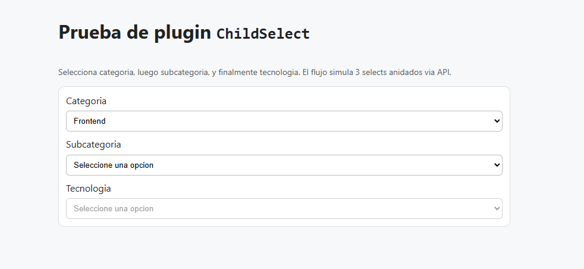
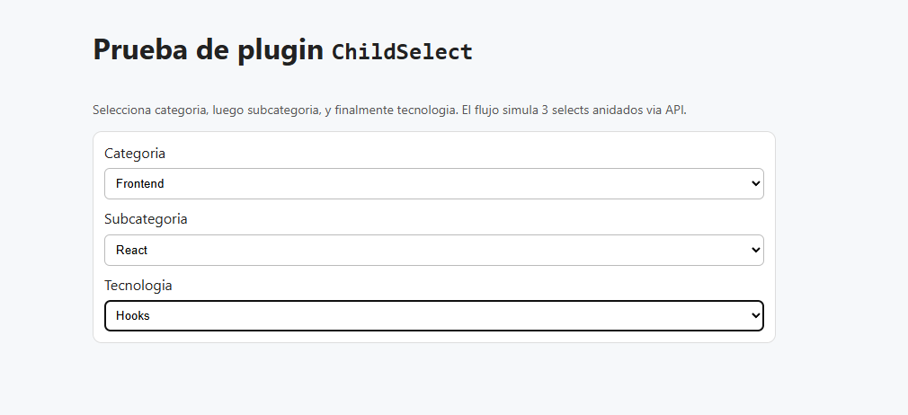

# ChildSelect

Native JavaScript plugin for dependent selects (parent-child) with dynamic option loading via `fetch`.

## Requirements

- A modern browser with support for `fetch`, `MutationObserver`, `WeakMap`, and `URL`
- A parent `<select>` with `data-role="parent-select"`
- A child `<select>` selector with `data-child-select`
- A data endpoint URL with `data-children-url`

## Installation

Include only the plugin:

```html
<script src="./childSelect.js"></script>
```

For production usage, if you do not need to read the source code, you can include the minified file:

```html
<script src="./childSelect.min.js"></script>
```

## Usage 1: Simple Parent-Child with `fetch`

```html
<select
  id="categorySelect"
  data-role="parent-select"
  data-child-select="#subcategorySelect"
  data-children-url="/api/subcategories"
  data-value-property="id"
  data-text-property="name">
  <option value="">Select category</option>
  <option value="frontend">Frontend</option>
  <option value="backend">Backend</option>
</select>

<select id="subcategorySelect">
  <option value="">-------</option>
</select>
```

## Usage 2: Chained Parent-Child (3 levels)

```html
<select
  id="categorySelect"
  data-role="parent-select"
  data-child-select="#subcategorySelect"
  data-children-url="/api/subcategories"
  data-value-property="id"
  data-text-property="name">
  <option value="">Select category</option>
  <option value="frontend">Frontend</option>
  <option value="backend">Backend</option>
</select>

<select
  id="subcategorySelect"
  data-role="parent-select"
  data-child-select="#technologySelect"
  data-children-url="/api/technologies"
  data-value-property="id"
  data-text-property="name">
  <option value="">-------</option>
</select>

<select id="technologySelect">
  <option value="">-------</option>
</select>
```

In both cases, the plugin uses `fetch` to load data and initializes automatically when the DOM is ready.

## How It Works

- Listens for changes on parent select (`data-role="parent-select"`).
- Calls `fetch` on `data-children-url` with params from `getParamsForChildren(parentValue)`.
- Clears and rebuilds child select options.
- Supports multi-level chaining (example: category -> subcategory -> technology).
- Supports flat and grouped data (`grouped`).
- Can retain child value, auto-select when a single option is returned, and disable child select when empty.

## Supported `data-*` attributes

- `data-role="parent-select"`: marks the `<select>` as a parent to activate the plugin through auto-init. Status: **required for auto-initialization**.
- `data-child-select`: CSS selector of the child `<select>` that will be populated. Status: **required**.
- `data-children-url`: endpoint used to fetch child options based on parent value. Status: **required**.
- `data-value-property`: property name used as the `<option>` `value`. Status: **optional**.
- `data-text-property`: property name used as visible `<option>` label. Status: **optional**.
- `data-group-options-property`: property containing grouped option collections. Status: **optional**.
- `data-group-text-property`: property used as group label (`<optgroup label="...">`). Status: **optional**.
- `data-grouped`: enables grouped data mode (true/false). Status: **optional**.
- `data-empty-text`: text used for the initial empty option in child select. Status: **optional**.
- `data-auto-select-single`: auto-selects when only one option is returned (true/false). Status: **optional**.
- `data-disable-when-empty`: disables child select when there are no options (true/false). Status: **optional**.
- `data-loading-class`: temporary CSS class applied to child select while loading. Status: **optional**.

## Manual Initialization (optional)

```html
<script>
  ChildSelect.init(document.querySelector('#countrySelect'));
  ChildSelect.initAll(document.querySelector('#formFilters'));
</script>
```

## Public API

```html
<script>
  const parentSelect = document.querySelector('#countrySelect')
      , instance = ChildSelect.init(parentSelect, {
          childrenUrl: '/api/cities',
          childSelectSelector: '#citySelect'
        });

  ChildSelect.getInstance(parentSelect);
  ChildSelect.destroy(parentSelect);
  ChildSelect.destroyAll(document.querySelector('#formFilters'));

  instance.destroy();
</script>
```

- `ChildSelect.init(element, options)`: creates or reuses an instance.
- `ChildSelect.getInstance(element)`: returns current instance or `null`.
- `ChildSelect.destroy(element)`: tears down a specific instance.
- `ChildSelect.destroyAll(root)`: tears down all instances inside a container.
- `instance.destroy()`: removes listeners for the current instance.

## Common Errors

- Missing `data-child-select`: throws an error.
- Missing `data-children-url`: throws an error.
- Child selector does not exist in DOM: logs a warning and skips updates.

## Demo

You can open the test file included in this project:

- `test-child-select.html`

## Example Preview

Initial example state (no selection in the first select):



State after selecting a value in the first select:



State after selecting values in the second and third selects:



