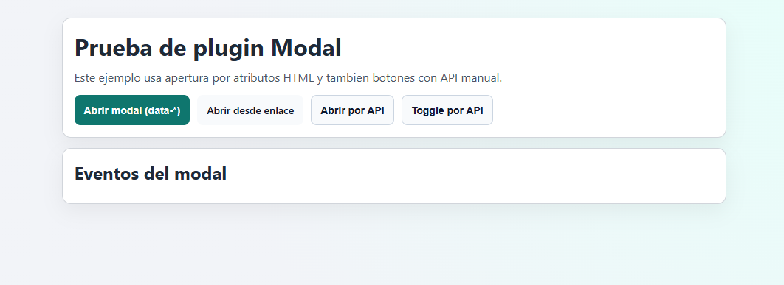
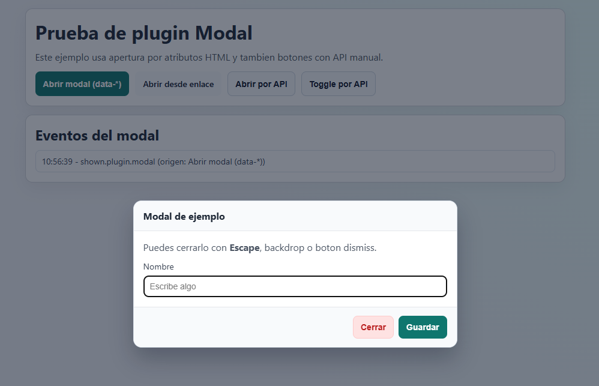

# Modal

Native plugin to open, close, and toggle modals without external dependencies.

## Requirements

- JavaScript with ECMAScript 2020 syntax.

## Include Script

```html
<script src="./modal.js"></script>
```
or
```html
<script src="./modal.min.js"></script>
```

## Quick Usage With HTML Attributes

```html
<button type="button" data-modal="toggle" data-modal-target="#myModal">
  Open modal
</button>

<div id="myModal" data-role="modal" aria-hidden="true">
  <div data-modal="backdrop">
    <div class="modal-content">
      <h3>My modal</h3>
      <p>Modal content.</p>
      <button type="button" data-modal="dismiss">Close</button>
    </div>
  </div>
</div>
```

You can also use a native `<dialog>` element:

```html
<button type="button" data-modal="toggle" data-modal-target="#nativeDialog">
  Open dialog
</button>

<dialog id="nativeDialog" data-modal-focus="true">
  <p>Hello from dialog.</p>
  <button type="button" data-modal="dismiss">Close</button>
</dialog>
```

## Example Preview

Initial state (modal closed):



Open state:



## Supported Attributes

- `data-modal="toggle"`: trigger to toggle open/close.
- `data-modal-target="#selector"`: CSS selector of the modal to control.
- `data-modal="dismiss"`: internal trigger to close the modal.
- `data-modal="backdrop"`: backdrop zone to close on click (if not static).
- `data-role="modal"`: marks a container as a modal subject.
- `data-modal-static="true|false"`: when `true`, backdrop click does not close.
- `data-modal-focus="true|false"`: focuses modal and first interactive element on open.
- `data-modal-keyboard="true|false"`: allows closing with Escape key.
- `data-modal-show="true|false"`: auto-opens when initialized.

## Public API

```js
const modalElement = document.querySelector('#myModal');

const instance = window.Modal.init(modalElement, {
  static: false,
  keyboard: true,
  focus: true,
  show: false,
});

instance.show();
instance.hide();
instance.toggle();

window.Modal.getInstance(modalElement);
window.Modal.destroy(modalElement);
window.Modal.initAll();
window.Modal.destroyAll();
```

## Custom Events

The plugin dispatches events on the modal element itself:

- `shown.plugin.modal`
- `hidden.plugin.modal`

Each event exposes the related source element (when available) in `event.detail.relatedTarget`.
